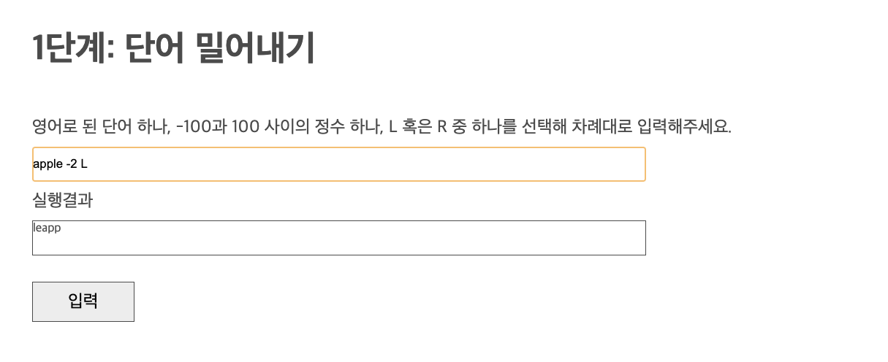
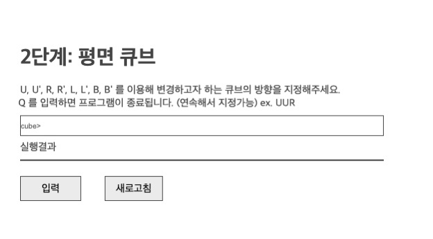
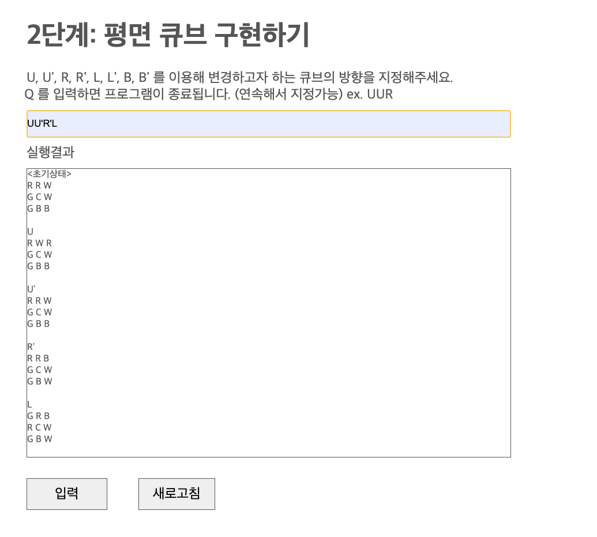
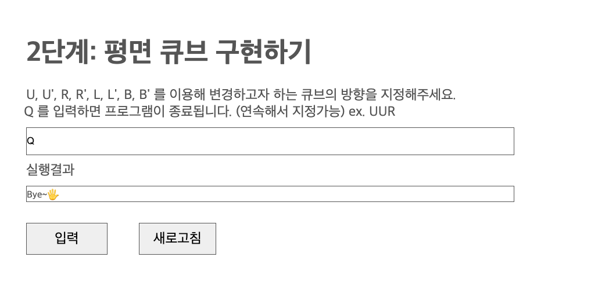
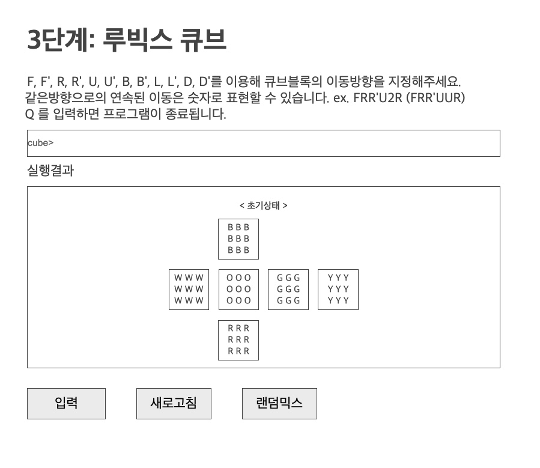
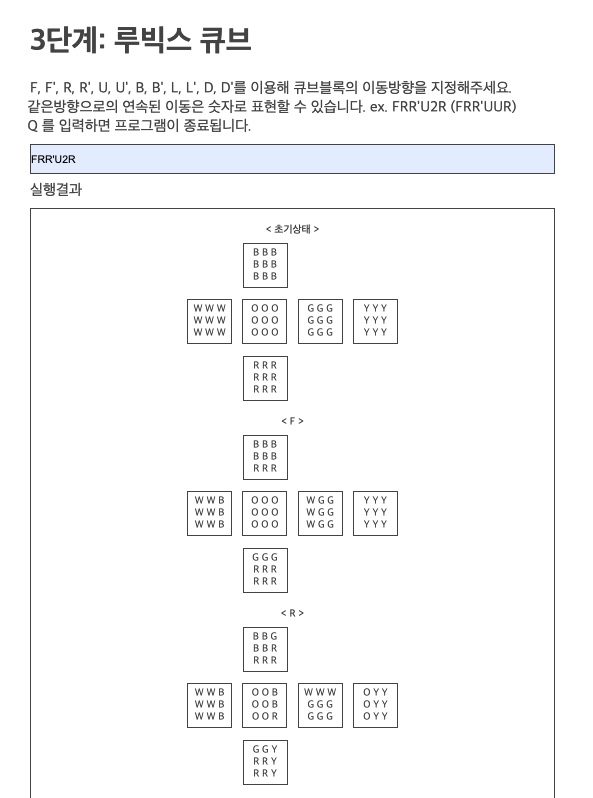
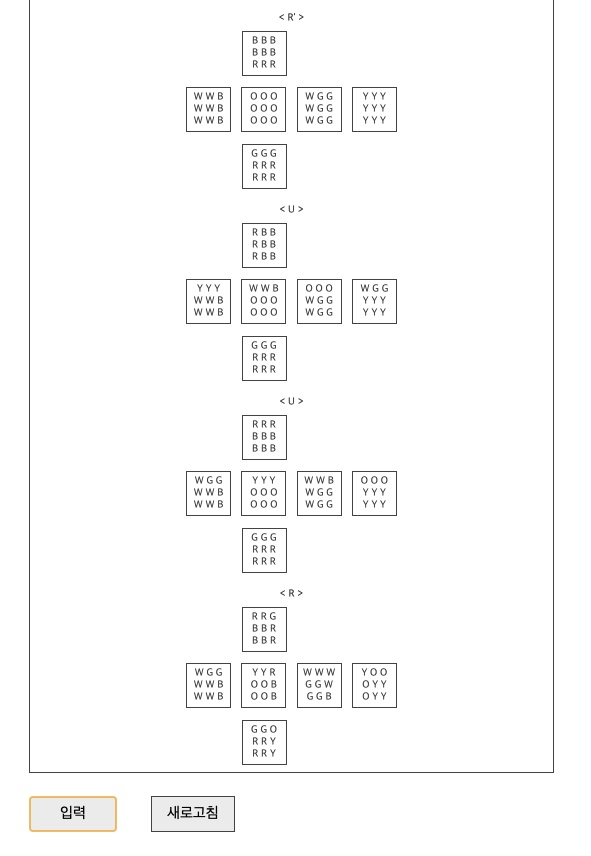
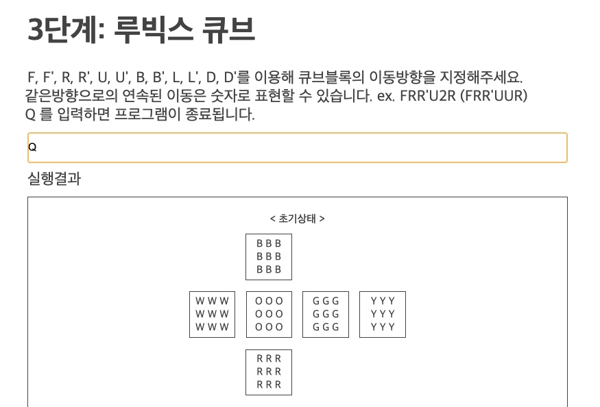
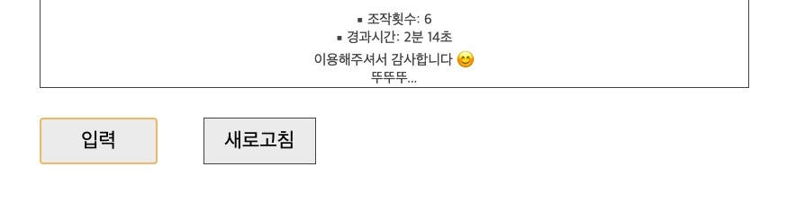

# 루빅스 큐브 구현하기

---

 

# Step 1. 단어 밀어내기 구현하기

## 동작과정

1. 상단의 input창에 사용자로부터 단어, 정수, L 또는 R을 차례대로 입력받는다.  
2. `입력`버튼의 클릭 이벤트로 각 input값을 배열로 저장한다. (ex. `["apple", "-2", "L"]`) 
3. 이동횟수의 절대값을 단어의 길이로 나누어 필요한 이동횟수를 최소화한다. 이 때 만일 이동횟수가 0이거나 단어의 길이와 일치할 경우, 곧바로 이동함수를 벗어난다. 
4. 일치하는 조건에 따라 글자를 오른쪽으로 밀거나 왼쪽으로 민다. 
   1. 왼쪽으로 밀기: `정수 & Left` 혹은 `음수 & Right` 
   2. 오른쪽으로 밀기: `정수 & Right` 혹은 `음수 & Left` 
5. 변환된 글자를 UI 하단의 실행결과 box에 렌더링한다. 

## 실행화면

 

---

 

# Step 2. 평면 큐브 구현하기

## Class별 역할

- `Model`클래스: 평면 큐브에 필요한 데이터를 저장/관리/핸들링 
- `View`클래스: DOM핸들링과 UI렌더링 관련 작업을 수행 
- `Controller`클래스: `Model`과 `View`클래스의 중계역할을 수행 

## 동작과정

1. 평면큐브의 기본모양은 `Model`클래스의 `cube` 이중배열로, 그리고 각각의 알파벳(`U`, `U'`, `R`, `R'`, `L`, `L'`, `B`, `B'`)이 의미하는 동작방향은 `Model`클래스 `direction`객체의 메소드로 저장한다. 
2. `cube>` input창에 사용사로부터 값을 입력받는다. 입력받은 값은 `입력`버튼의 클릭이벤트와 함께 split되어 배열 내에 저장된다. 
   이 때 `'`는 바로 앞전의 글자와 합쳐지는 과정을 거친다. (ex. `["U", "U'", "R'", "L"]`) 
3. 저장된 배열을 순회하면서 `direction`객체에서 해당글자와 일치하는 key값을 찾아 메소드를 차례대로 실행한다.  

   1. `R`, `R'`, `L`, `L'`의 경우, 시계방향으로 90도를 회전한 후 오른쪽 혹은 왼쪽으로 글자를 이동시킨다. 그리고 다시 시계반대방향으로 90도를 회전해 원래 방향으로 돌려놓는다. 
   2. `Q`의 경우, 곧바로 실행결과 box에 종료메세지를 반환한다. 

4. 엘리먼트의 이동이 완료된 `cube`배열은 template literal을 통해 큐브형태로 만든 다음, UI에 렌더링한다. 
5. 각 이동단계마다 위 과정을 반복하면서 평면 큐브의 변화 과정을 하단의 실행결과 box에 반환한다. 
6. `새로고침`버튼 클릭 시 페이지를 다시 로딩해 초기화면으로 돌아갈 수 있게 한다. 

## 시작화면

## 실행화면

## 종료화면

 

---

 

# Step 3. 루빅스 큐브 구현하기

## Class별 역할

- `Data`클래스: 데이터 저장 및 핸들링 
- `Rotation`클래스: 큐브의 회전과 요소의 이동작업을 수행 
- `Visual`클래스: UI와 DOM관련 작업을 수행 
- `Operator`클래스: 각 클래스들을 연결하고 전체적인 프로세스를 진행 

## 동작과정

1. `Data`클래스의 `triple_arr`에 3중 배열로 큐브데이터를 저장한다. 
2. `orderType`에는 각 방향으로 회전 시 이동하는 요소의 인덱스들을 저장한다. 
3. `cube>` input창에 사용자로부터 값(`F`, `F'`, `R`, `R'`, `U`, `U'`, `B`, `B'`, `L`, `L'`, `D`, `D'`)을 입력받는다. 
4. 입력받은 string을 배열의 형태로 변환해 `convertedString`에 저장한다. (ex. `["F", "R", "R'", "U", "U", "R"]`) 
5. `convertedString`을 반복문으로 순회하면서 `triple_arr`로부터 해당 방향으로 회전 시 이동이 필요한 요소들을 인덱스로 가져와 임시배열인 `tempArr`에 저장한다. 
6. 저장된 `tempArr` 내부요소들은 이동방향에 알맞게 오른쪽 혹은 왼쪽으로 3칸씩 밀어준다. (3칸을 1면으로 고려; 방향에 `'`가 있을 경우 왼쪽으로, 없을 경우 오른쪽으로 이동시킨다.) 

7. 변경된 `tempArr`의 요소들은 다시 인덱스를 기준(가지고 온 순서 그대로)으로 `triple_arr`에 재할당 해준다. 
8. 중심이 되는 면도 1번의 회전마다 시계방향 혹은 반시계방향으로 90도씩 돌려서 재배치한다. 
9. 새로운 `div`에 template literal로 `triple_arr`데이터를 입력해 큐브모양을 만든 후 회전방향타입과 함께 UI의 실행결과 box에 렌더링한다. 
10. 5-9번에 해당하는 과정을 매 회전마다 반복하며 결과를 출력한다. 
11. `Q`입력 시 조작횟수, 경과시간, 종료메세지를 반환하며 프로그램을 종료시킨다.

## 시작화면

## 실행화면

## 종료화면

 
(중간과정 생략)
 

