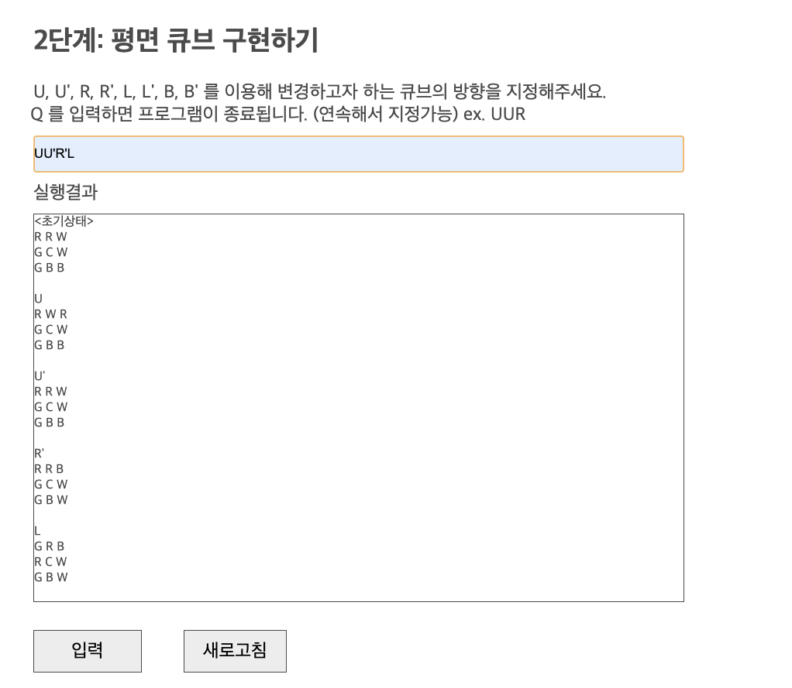

# 루빅스 큐브 구현하기

## Step 1. 단어 밀어내기 구현하기

1. 상단의 input창에 사용자로부터 단어, 정수, L 또는 R을 입력받으면,  
2. 해당 조건에 따라 정정된 단어를 하단의 box에 반환한다.

- <UI 이미지> 

## Step 2. 평면 큐브 구현하기

1. 상단의 input창에 사용사로부터 값(U, U', R, R', L, L', B, B')을 입력받으면, 
2. 해당 조건에 따라 회전하는 평면 큐브의 변화 과정을 하단의 box에 반환한다.

- <UI 이미지> 
