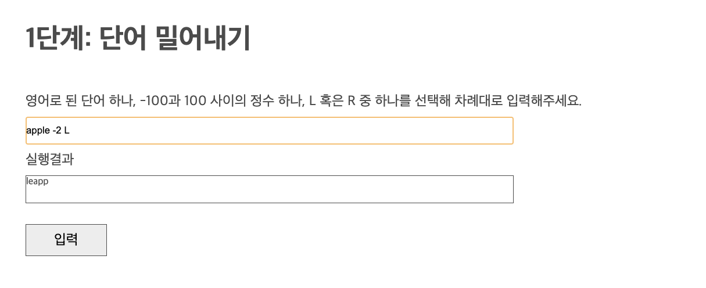
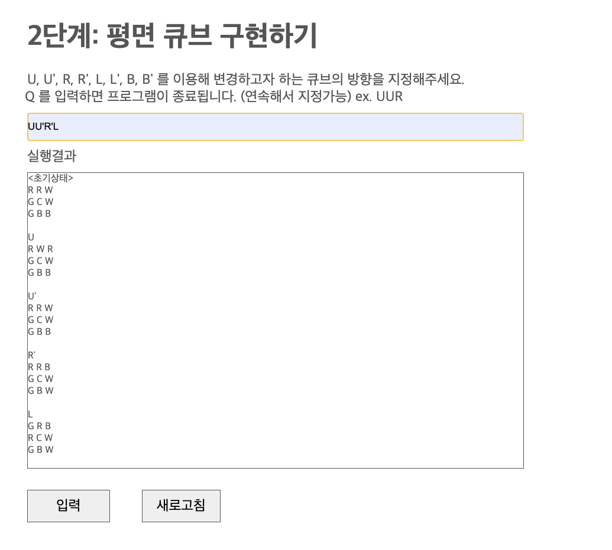
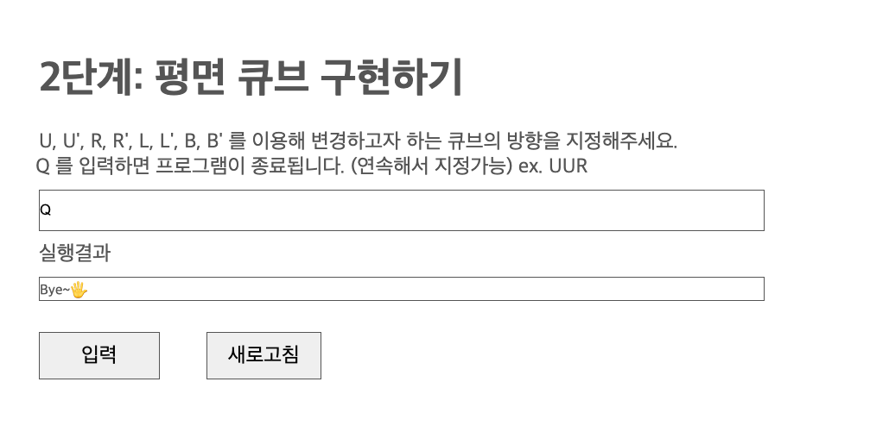
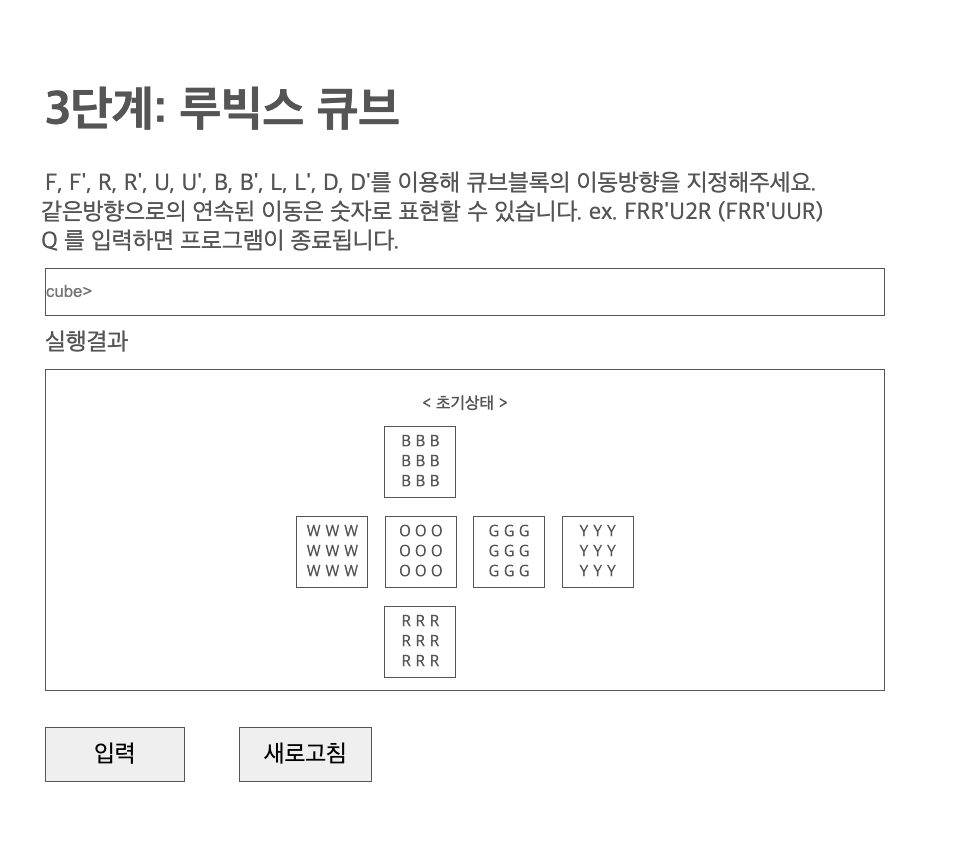

# 루빅스 큐브 구현하기

---

 

#  Step 1. 단어 밀어내기 구현하기 

## 동작과정

1. 상단의 input창에 사용자로부터 단어, 정수, L 또는 R을 차례대로 입력받는다.  
2. `입력`버튼의 클릭 이벤트로 각 input값을 배열로 저장한다. (ex. `["apple", "-2", "L"]`) 
3. 이동횟수의 절대값을 단어의 길이로 나누어 필요한 이동횟수를 최소화한다. 이 때 만일 이동횟수가 0이거나 단어의 길이와 일치할 경우, 곧바로 이동함수를 벗어난다. 
4. 일치하는 조건에 따라 글자를 오른쪽으로 밀거나 왼쪽으로 민다. 
   1. 왼쪽으로 밀기: `정수 & Left` 혹은 `음수 & Right` 
   2. 오른쪽으로 밀기: `정수 & Right` 혹은 `음수 & Left` 
5. 변환된 글자를 UI 하단의 box에 렌더링한다. 

## 실행화면

 

---

 

#  Step 2. 평면 큐브 구현하기 

## 동작과정

1. `cube>` input창에 사용사로부터 값(U, U', R, R', L, L', B, B')을 입력받는다. 
2. 해당 조건에 따라 회전하는 평면 큐브의 변화 과정을 하단의 box에 반환한다.

## 실행화면

## 종료화면

 

---

 

#  Step 3. 루빅스 큐브 구현하기 

## 동작과정

1. `cube>` input창에 사용자로부터 값(F, F', R, R', U, U', B, B', L, L', D, D')을 입력받는다. 
2. 입력받은 string을 배열의 형태로 변환한다. (ex. `["F", "R", "R'", "U", "U", "R"]`)

## 시작화면

